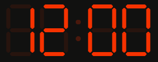
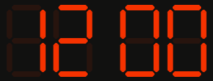
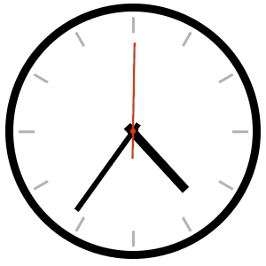
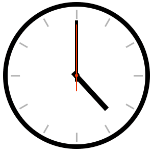
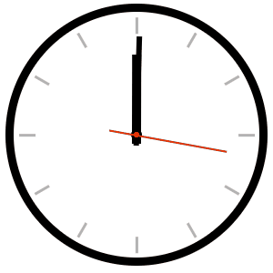

# Cvičení: Hodiny

## Zadání

1. Otevři si soubor `moje-styly.css` a doplň ho podle následujících instrukcí. V celém cvičení není potřeba upravovat žádné jiné soubory.

### Digitální hodiny

1. Vytvoř animaci, která bude s prvkem `.digitalni__dvojtecka` blikat.

   1. Využij vlastnost `opacity`, která má výchozí hodnotu `1`. Pro zneviditelnění prvku nastav `0`.

   1. Animaci nastav dobu trvání na jednu sekundu.

   1. Nech ji běžet do nekonečna.

   

1. Nech dvojtečku blikat bez prolínání.

   

#### Poznámka

Hodiny budou stále ukazovat 12:00, resp. `12:00` a `12 00`. Tím se netrap. Pro změnu cifer podle aktuálního čas by byl potřeba JavaScript, který není náplní tohoto cvičení.

### Analogové hodiny

1. Vytvoř animaci, která bude otáčet s vteřinovou ručičkou `.analogove__vterinova`.

   - Animace by neměla nikdy skončit. Nech ručičku točit neustále dokola.

   - Každá sekunda by měla být stejně dlouhá. Pozor na to, že animace jsou ve výchozím chování pomalé na začátku a na konci.

   - Na zkoušku zrychli animaci 10×. Jedna otáčka by tedy měla trvat 6 sekund.

   

1. Doplň podobnou animaci i pro minutovou ručičku `.analogove__minutova`.

   - Minutovou i vteřinovou animaci zrychli 100× proti reálnému času.

   

1. Doplň točení i hodinové ručičky `.analogove__hodinova`.

   - Všechny ručičky zrychli 1000×.

   
